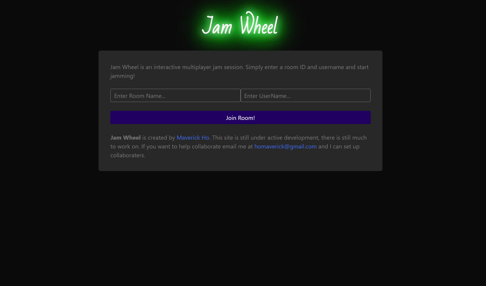

# Jam-Wheel

## What is this?
This is a web application for users to jam together! Just enter a room ID and username, and you're connected to users in that room. Play notes on the jam wheel to make beats with other users.

## Technologies
Updated to write the back-end in rust. Currently uses [Rust Warp](https://docs.rs/warp/0.3.1/warp/) to host the API and websocket. Inspiration on how to build the server was taken from this block at [LogRocket](https://blog.logrocket.com/how-to-build-a-websocket-server-with-rust/). The music components are written using [Tone.js](https://tonejs.github.io/), and the visualization is written with the [P5.js](https://p5js.org/) library.

## Development
This application is still under development, there's still a lot of work to do!
#Incoming Features
- Randomized User names.
- Better sound quality and buffering.
- Better instruments.