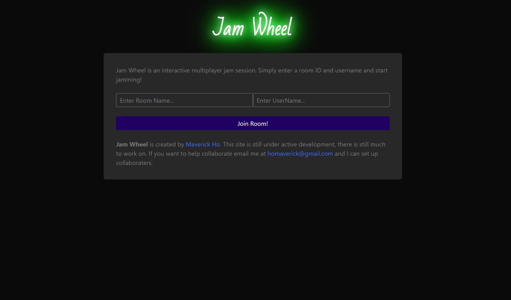

# Jam-Wheel

## What is this?

This is a web application for users to jam together! Just enter a room ID and username, and you're connected to users in that room. Play notes on the jam wheel to make beats with other users.

## Technologies

Updated to write the back-end in rust. Currently uses [Rust Warp](https://docs.rs/warp/0.3.1/warp/) to host the API and websocket. Inspiration on how to build the server was taken from this block at [LogRocket](https://blog.logrocket.com/how-to-build-a-websocket-server-with-rust/). The music components are written using [Tone.js](https://tonejs.github.io/), and the visualization is written with the [P5.js](https://p5js.org/) library.

## Development

This application is still under development, there's still a lot of work to do!

# Building Node Modules

This project uses yarn to keep track of dependencies.

Use `yarn add` and `yarn install` to add dependencies into the project.

## Prerequisites

- Node.js + Yarn (`corepack enable` works if you don't have Yarn installed separately)
  - Current project uses node version: v24.17.0
  - `nvm use` in parent directory
- Rust + Cargo (via [rustup](https://rustup.rs))
- GNU Make

## Makefile Common commands

| Command                                   | What it does                                                                                             |
| ----------------------------------------- | -------------------------------------------------------------------------------------------------------- |
| `make dev`                                | Runs client and server together, with color-coded `[client]`/`[server]` log prefixes. Ctrl-C stops both. |
| `make dev-client`                         | Runs only the client dev server.                                                                         |
| `make dev-server`                         | Runs only the server.                                                                                    |
| `make build`                              | Builds both for production (client bundle + release server binary).                                      |
| `make build-client` / `make build-server` | Builds just one side.                                                                                    |
| `make test`                               | Runs both test suites.                                                                                   |
| `make test-client` / `make test-server`   | Runs just one side's tests.                                                                              |
| `make clean`                              | Removes installed packages, build output, and cached state for both sides.                               |

Makefile reference: https://tech.davis-hansson.com/p/make/
